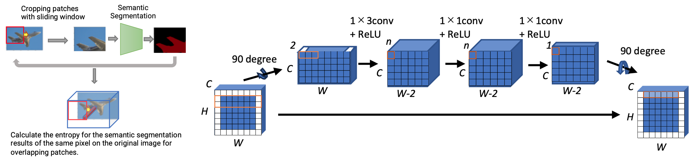

# pp-pad
This repository contains the pytorch implementation of pp-pad (peripheral prediction padding) in ICIP2023 paper:

- Kensuke Mukai and Takao Yamanaka, "Improving Translation Invariance in Convolutional Neural Networks with Peripheral Prediction Padding," International Conference on Image Processing (ICIP), 2023, Kuala Lumpur, Malaysia. [arXiv https://arxiv.org/abs/2307.07725]

# Downloads
In addition to this repository, download the following files, and then place them under the pp-pad folders.

- VOCtrainval_11-May-2012.tar:  
-- Download 'VOCtrainval_11-May-2012.tar' from 'Download the training/validation data (2GB tar file)' in http://host.robots.ox.ac.uk/pascal/VOC/voc2012/#devkit  
-- Place 'VOCdevkit' folder under pp-pad/program/dataset/
- [weights.zip](https://drive.google.com/file/d/1mKZxRhL1VDRNTppBJHN_ljHf_O6FUQJe/view?usp=sharing) (522 MB): pp-pad/program/weights

# Examples
Change current directory:
> cd program

To train the network:
> python PSPNet.py --cfg config/cfg_sample.yaml

To evaluate the translation invarinace and classification accuracy:
> python segment_val.py --cfg config/cfg_sample.yaml

The results are saved in the 'program/outputs' directory. The filepath and other settings are specified in the config file 'config/*.yaml'.

To save the visualized results, set the hyper-parameter 'save_patches' in the config file (.yaml) to True and then run the segment_val.py:
> python segment_val.py --cfg config/cfg_sample.yaml

Sample images can be obtained in the 'program/samples' directory.

# Settings in Config (program/config)
The yaml file can be modified in a text editor.  
sample config file: program/config/cfg_sample.yaml

[padding mode]
- padding_mode: Select from 'pp-pad', 'zeros', 'reflect', 'replicate', 'circular', 'partial', 'cap_pretrain', or 'cap_train'. For 'cap_pretrain' and 'cap_train', use them in this order, since pretrain is required in CAP.

[path for PSPNet.py]
- dataset: Dataset folder
- pretrain: Initial weights for the network
- outputs: Output folder

[training parameters]
- num_epoches: Number of training epochs
- val_output_interval: Interval for validation [epochs]
- batch_size
- batch_multiplier: Weights are updated every batch_multiplier, which means the effective batch size is batch_size x batch_multiplier
- optimizer: sgd or adam

[path for segment_val.py]
- val_images: Validation file list for evaluation of translation invariance and classification accuracy. Only 100 images were used for evaluation due to the computational cost.
- weights: Network model for evaluation

[image sizes]
- input_size: Patch size extracted from original image in training and evaluation
- expanded_size: Original image was first resized into expanded_size in the long side, and then croped in the input_size specified above.
- patch_stride: Stride of sliding window in evaluation creating overlapping patches

[dataset info]
- color_mean: Mean values of images in the dataset
- color_std: Standard deviations of images in the dataset

[to save patches and visualize inference results]
- save_patches: True / False
- sample_images: Image files to save patches and visualize inference results

# Results
The values in the following results were different from the original ICIP2023 paper[1], especially in meanE, because there were bugs in the initial implementation for calculating meanE. The following is the results obatained by the current code. The network was trained in 320 epoches.

[Simple mean IOU (excluding background), meanE & disR (including background class)]
- mIoU is simple mean of IoU, but not weighted average. The background class was excluded in the calculation of IoU.
- meanE and disR were calculated including background class.

| | Methods | mIoU &uarr; | meanE_in &darr;| disR_in &darr; |
| ---- | ---- | ---- | ---- | ---- |
| Conventional | Zero | 0.3193 | 0.4315 | 0.5721 |
| | Reflect | 0.3090 | 0.4826 | 0.6087 |
| | Replicate | 0.3100 | 0.4745 | 0.6038 |
| | Circular | 0.3062 | 0.4923 | 0.6126 |
| Previous | CAP [19] | **0.3300** | 0.4440 | 0.5794 |
| | Partial [17] | 0.3184 | 0.4575 | 0.5893 |
| Proposed | PP-Pad (2x3) | 0.3203 | <ins>0.4221</ins> | <ins>0.5443</ins> |
| | PP-Pad (2x3 conv) | <ins>0.3255</ins> | **0.4195** | **0.5423** |

[Weighted average IOU, meanE, and disR excluding background class]

- Weighted average version of mIoU (mIoU_weighted). Each patch was weighted by the number of effective pixels. 'effective' means that union of predicted area and ground-truth area is not zero in at least one class when (excluding the background class) calculating IoU for each patch. By weighting, patches filled with the background can be less contributed to mIoU, since the background class was excluded in mIoU calculations.
- meanE & disR excluding the background class in annotation (meanE_ex, disR_ex)

| | Methods | mIoU_weighted &uarr; | meanE_ex &darr; | disR_ex &darr; |
| ---- | ---- | ---- | ---- | ---- |
| Conventional | Zero | 0.4104 | 0.5397 | 0.6997 |
| | Reflect | 0.3941 | 0.6016 | 0.7605 |
| | Replicate | 0.3990 | 0.5953 | 0.7565 |
| | Circular | 0.3879 | 0.6205 | 0.7593 |
| Previous | CAP [19] | **0.4189** | 0.5419 | 0.7040 |
| | Partial [17] | 0.4062 | 0.5900 | 0.7462 |
| Proposed | PP-Pad (2x3) | 0.4120 |<ins>0.5272</ins> | <ins>0.6820</ins> |
| | PP-Pad (2x3 conv) | <ins>0.4182</ins> | **0.5118** | **0.6745** |

# References
1. Kensuke Mukai and Takao Yamanaka, "Improving Translation Invariance in Convolutional Neural Networks with Peripheral Prediction Padding," ICIP2023. https://arxiv.org/abs/2307.07725
2. Hengshuang Zhao, Jianping Shi, Xiaojuan Qi, Xiaogang Wang, and Jiaya Jia, "Pyramid Scene Parsing Network," CVPR2017. https://arxiv.org/abs/1612.01105
3. Yu-Hui Huang, Marc Proesmans, and Luc Van Gool, "Context-aware Padding for Semantic Segmentation," arXiv 2021. https://arxiv.org/abs/2109.07854
4. Guilin Liu, Kevin J. Shih, Ting-Chun Wang, Fitsum A. Reda, Karan Sapra, Zhiding Yu, Andrew Tao, and Bryan Catanzaro, "Partial Convolution based Padding," arXiv 2018. https://arxiv.org/abs/1811.11718

# Versions
The codes were confired with the following versions.
- Python 3.7.13
- Pytorch 1.13.0+cu117
- NVIDIA Driver 510.108.03
- CUDA 11.6