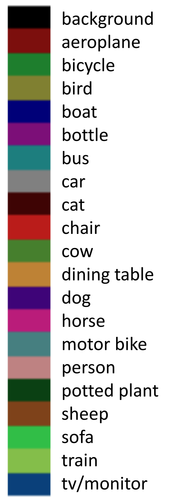
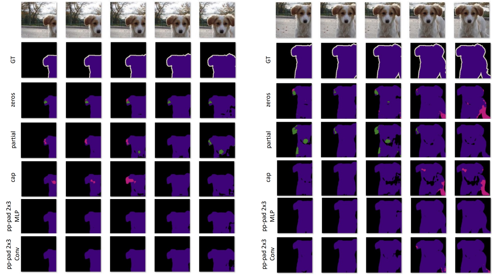
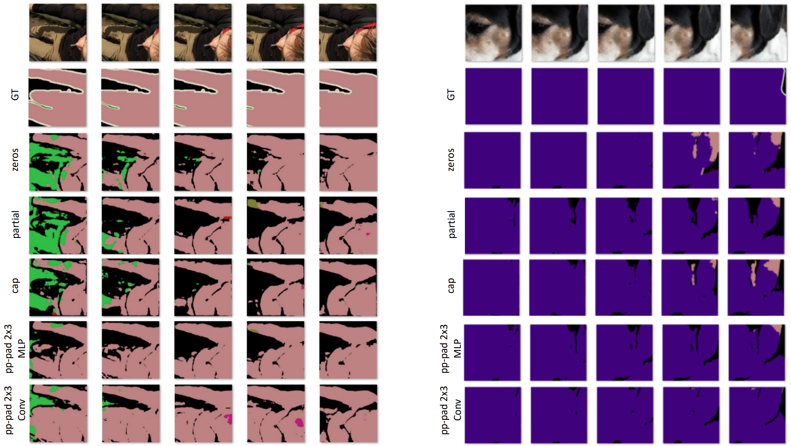
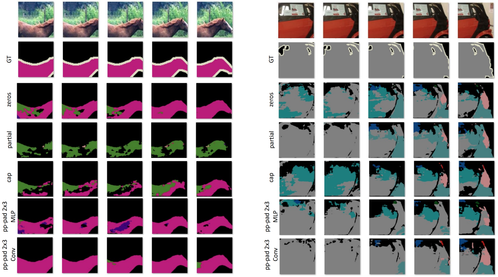
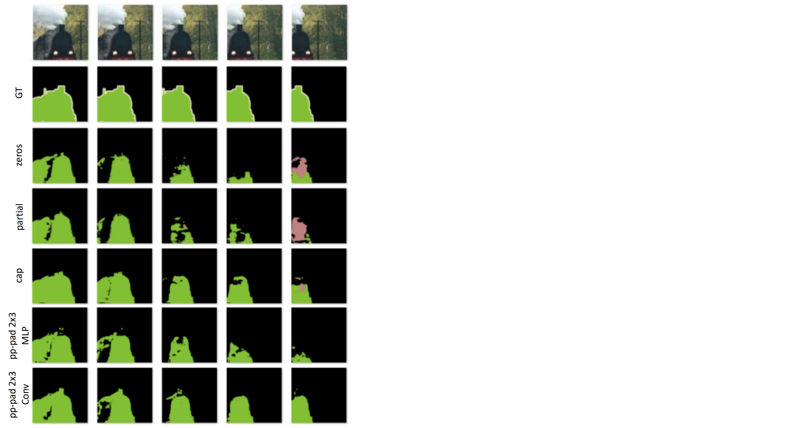
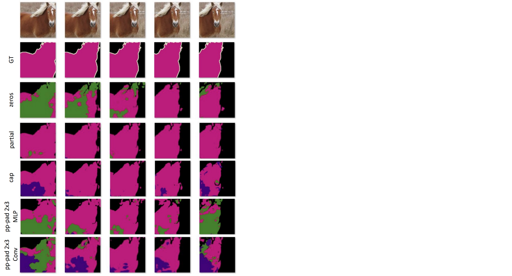
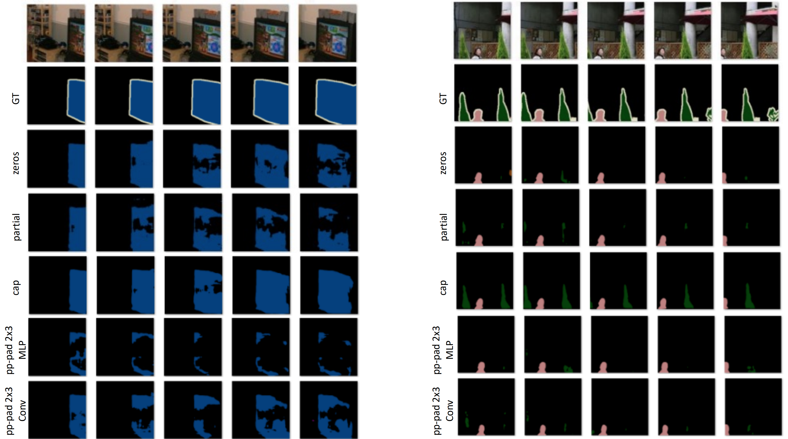

# Qualitative Comparison

## The examples that PP-Pad was better than other padding methods

2010_001908

2010_002792 / 2010_005159

2008_004175 / 2011_003055

2009_001300

## The examples that Partial (previous method) was better than other padding methods

2009_004942

## The examples that CAP (previous method) was better than other padding methods

2008_006159 / 2007_009750

