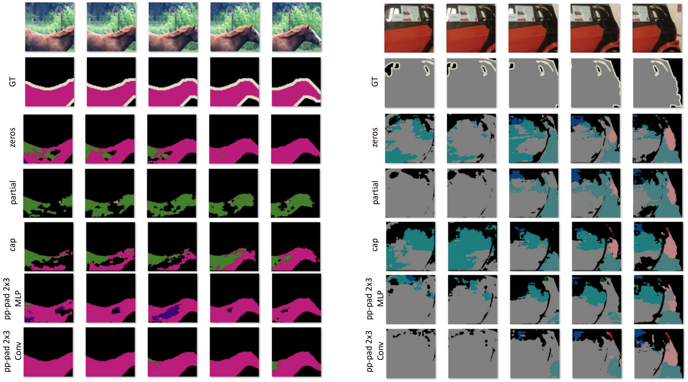
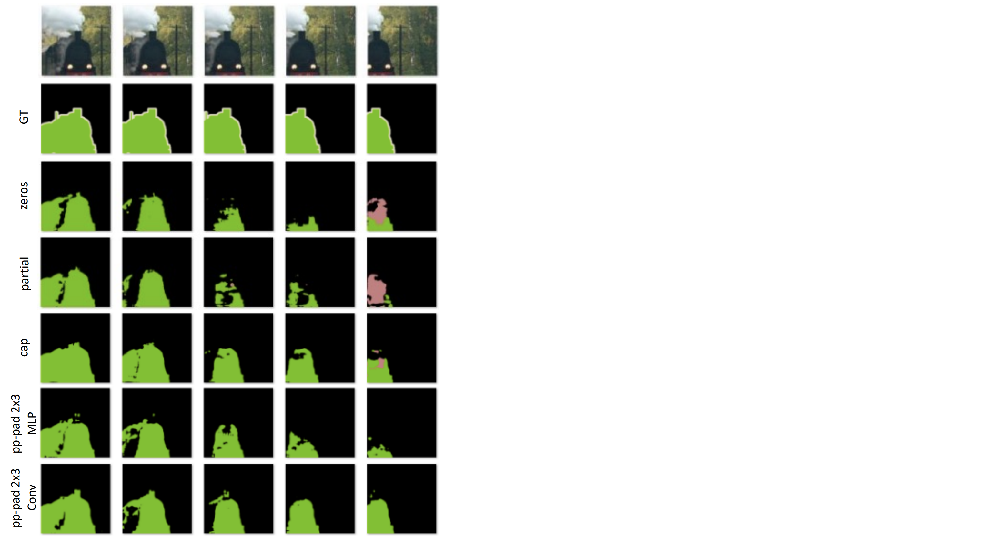
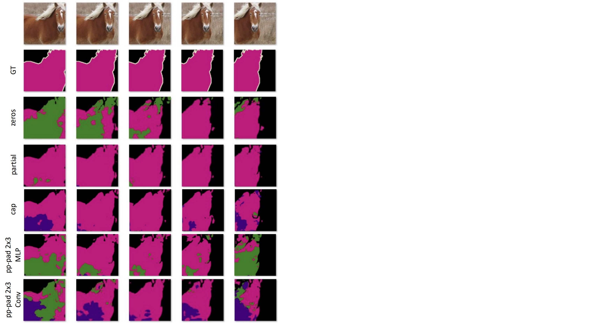
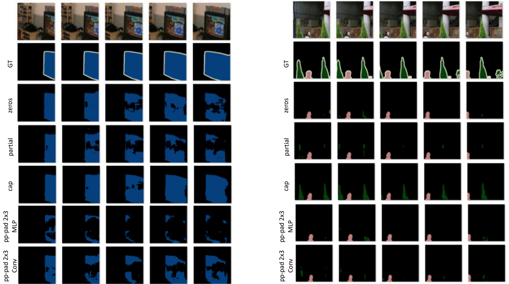

# Qualitative Comparison

## The examples that PP-Pad was better than other padding methods

## The examples that Patial (previous method) was better than other padding methods

## The examples that Patial (previous method) was better than other padding methods

